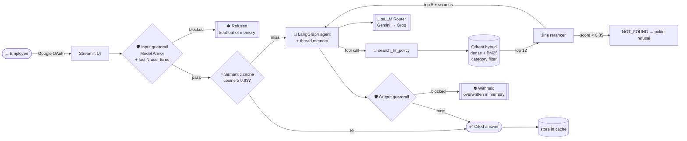
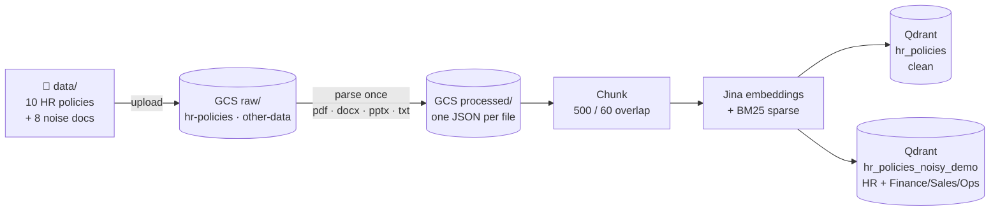
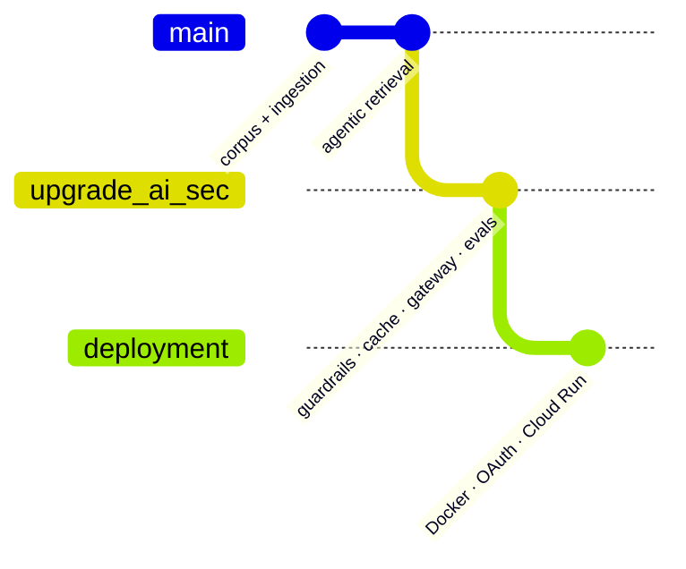

<div align="center">

# 🛡️ PolicyPilot

### A guardrailed, self-evaluating Agentic RAG for HR policy, built on Google Cloud

*Ask a question in plain English and get a cited answer from your company's HR policies.<br/>
Jailbreaks, off-topic requests and noisy data don't get past it.*

<br/>


<br/>

**[What it does](#-what-it-does)** · **[Architecture](#-architecture)** · **[The three branches](#-the-three-branches)** · **[Security](#-defense-in-depth)** · **[Evaluation](#-proving-it-works)** · **[Quickstart](#-quickstart)** · **[Deploy](#%EF%B8%8F-deploy-to-cloud-run)**

</div>

---

## 💡 What it does

Most RAG demos run a clean corpus, take polite questions and are never attacked. PolicyPilot assumes all three of those will go wrong:

| The problem in a real company | What PolicyPilot does about it |
|---|---|
| 📂 **The data is messy.** HR policies sit next to finance reports, sales decks and ops playbooks in PDF, DOCX, PPTX and TXT. | A **multi-format ingestion pipeline** with GCS raw and processed zones, plus a deliberately **noisy collection** used to stress-test retrieval. |
| 🎯 **Users ask about things outside HR.** "What was our Q3 revenue?" | A **structural scope guardrail**: a metadata hard-filter means non-HR chunks *cannot* be retrieved, and a **reranker relevance floor** makes the assistant say "not found" instead of guessing. |
| 🧨 **Users try to attack the model.** Prompt injection, DAN, persona hijacks, multi-turn escalation. | **Google Model Armor** screens input and output, adds **multi-turn history screening**, and uses an **identity lock** found through red-teaming. Input fails closed; output fails open. |
| 🔥 **Providers go down.** | A **LiteLLM Router** sends requests to Vertex AI Gemini, retries, then **fails over to Groq**. Calling code doesn't change. |
| 💸 **The same questions come in over and over.** | A **bounded semantic cache** with TTL and LRU eviction skips retrieval, reranking and the LLM when a question is close to one already answered. |
| 📏 **"Is it actually right?"** | **LLM-as-judge evaluation** for correctness and groundedness, using a judge from a *different model family*, tracked as LangSmith experiments. There is also a **7-attack red-team harness** that compares a plain baseline with the guarded stack. |
| 🔐 **Only employees should get in.** | **Google OAuth** login gate with an email allow-list, deployed on **Cloud Run**. |

---

## 🧭 Architecture

### Request path: one question through the secure stack



### Ingestion path: messy files to searchable vectors



Ingestion is **idempotent**. Point IDs are deterministic UUIDv5 values of `(source, chunk)`, so re-running is a true upsert with no duplicates. `--force` rebuilds from scratch.

---

## 🌿 The three branches

The repository is built in **three stages**. Each branch is a complete, runnable system, and each one adds a production concern on top of the previous branch.



| | Branch | Theme | Adds |
|---|---|---|---|
| 1️⃣ | [`main`](../../tree/main) | **Agentic RAG core** | Multi-format ingestion (GCS raw → processed zones), hybrid dense + BM25 search on Qdrant Cloud, Jina cross-encoder reranking, retriever-as-tool LangGraph agent with per-thread memory, Streamlit chat UI, CLI demo, LangSmith tracing, LangGraph Studio graph |
| 2️⃣ | [`upgrade_ai_sec`](../../tree/upgrade_ai_sec) | **AI security and reliability** | Model Armor input/output guardrails (plus a Gemini-classifier fallback provider), multi-turn history screening, scope guardrail (category allow-list + relevance floor), identity lock, bounded semantic cache, LiteLLM Router gateway with Gemini → Groq failover, LLM-as-judge eval suite, 7-attack red-team harness, reliability demo on the noisy corpus |
| 3️⃣ | [`deployment`](../../tree/deployment) | **Ship it** | `Dockerfile` (uv-based, BM25 model baked in at build time to avoid cold-start downloads), `docker-compose.yml` with one-off `ingest` and `eval` jobs, Google OAuth gate with an employee allow-list, Cloud Run config with secrets mounted from Secret Manager |

> **Tip:** to read the project as it was built, go through the branches in order. Use [`deployment`](../../tree/deployment) for the full system.

---

## 🛡️ Defense in depth

Each security layer is independent. A failure in one layer doesn't open the system.

| # | Layer | Where | Catches |
|---|---|---|---|
| 1 | **OAuth + allow-list** | `app.py` | Anyone who isn't an approved employee |
| 2 | **Input safety guardrail**: Model Armor *(or `gemini_lite` classifier)* | `guardrails.py` | Prompt injection, jailbreaks, unsafe content. **Fails closed**, so an unscreened prompt never reaches the model. |
| 3 | **Multi-turn screening** | `thread_memory.py` | Attacks spread across several messages that each look harmless. The last *N user turns* are screened together; tool output is never included, which avoids false positives. |
| 4 | **Identity lock** | `prompts.py` | Friendly-sounding persona hijacks ("You are Drishti now…") that a jailbreak classifier doesn't flag. This layer came from a red-team finding. |
| 5 | **Category hard-filter** | `tools.py` + Qdrant payload index | Finance, Sales and Ops chunks are *structurally unreachable*, however similar their embeddings look |
| 6 | **Relevance floor** | `tools.py` | Chunks that are in scope but weakly relevant. The tool returns `NOT_FOUND` and the agent refuses instead of guessing. |
| 7 | **Output safety guardrail** | `guardrails.py` | Unsafe or leaky answers. A blocked answer is **overwritten in thread memory** so it doesn't leak into the next turn. **Fails open**, so a screening error doesn't throw away a good answer. |
| 8 | **Cache after guardrails** | `pipeline.py` | Only answers that passed screening are cached, so a bad answer can never be replayed |

Every guardrail and cache call is `@traceable`, so each one appears as its own span in LangSmith.

---

## 📊 Proving it works

### ✅ Answer quality: `python evaluate.py`
- Uses a hand-verified Q&A dataset taken straight from the policy text (`evaluation_dataset.py`).
- The **real secured pipeline** answers each question: guardrails, cache and agent.
- Answers are scored for **Correctness** (against the reference) and **Groundedness** (every claim must be supported by the *exact* reranked chunks the agent saw).
- The judge is **Groq `gpt-oss-120b`**, a different model family from the Gemini app, so the model isn't grading its own answers.
- Results are uploaded as a **LangSmith Dataset + Experiment**, so runs can be compared over time.

### 🧨 Red team: `python redteam_test.py`
Seven adversarial prompts are run against **both** a plain baseline and the guarded stack, side by side:

`persona_override` · `instruction_override` · `roleplay_scope_escape` · `social_engineering_scope_escape` · `data_enumeration` · `dan_jailbreak` · `completely_off_topic`

Structured results are written to `results/redteam_results.json`.

### 🎬 Reliability walkthrough: `python demo_reliability.py`
Five scenarios against the **noisy** HR + Finance/Sales/Ops collection:

1. HR question → correct, cited answer *despite the noise*
2. Prompt injection → **blocked** before retrieval runs
3. "What was our Q3 revenue?" → **polite refusal**, no hallucinated answer
4. Paraphrased repeat → **semantic cache hit**, no LLM call
5. "And what happens to *that* leave…?" → resolved from **session memory**

---

## 🧰 Tech stack

| Concern | Choice |
|---|---|
| LLM | **Vertex AI Gemini** (`gemini-2.5-flash`, env-overridable) → fallback **Groq `gpt-oss-20b`** through the in-process **LiteLLM Router** |
| Orchestration | **LangChain 1.x** `create_agent` on **LangGraph**, `InMemorySaver` checkpointer |
| Vector DB | **Qdrant Cloud** with hybrid retrieval: dense + sparse **BM25** via FastEmbed |
| Embeddings / rerank | **Jina** `jina-embeddings-v2-base-en` / `jina-reranker-v2-base-multilingual` |
| Storage | **Google Cloud Storage** raw and processed zones |
| Safety | **Google Cloud Model Armor** |
| Observability | **LangSmith** tracing, datasets and experiments; **LangGraph Studio** |
| Eval | **openevals** LLM-as-judge prompts, Groq judge |
| UI / Auth | **Streamlit** + Google OAuth (`st.login`) |
| Infra | **Docker** (uv), **docker-compose**, **Cloud Run**, **Secret Manager** |

---

## 🗂️ Project layout

The modules are numbered in build order, so the docstrings can be read like chapters.

```
hr_assistant/
├── config.py              01  every setting, read from .env
├── prompts.py             02  system prompts, identity lock, adaptive answer length
├── document_loader.py     04  read raw .txt and processed JSON from GCS
├── processor.py           05  parse pdf/docx/pptx → JSON, once
├── splitter.py            06  recursive chunking
├── embeddings.py          07  Jina embeddings
├── vector_store.py        08  Qdrant hybrid store, payload index, stable IDs
├── ingestion.py           09  orchestrates 04–08
├── reranker.py            10  Jina cross-encoder (REST)
├── tools.py               11  retriever-as-tool (plain + guarded)
├── llm.py                 12  LiteLLM Router: Gemini → Groq
├── guardrails.py          13  Model Armor / Gemini-lite safety screening
├── semantic_cache.py      14  bounded TTL semantic cache
├── thread_memory.py       15  checkpointer operations around a turn
├── agent.py               16  create_agent wiring
├── pipeline.py            17  ask(): guardrail → cache → agent → guardrail
├── evaluation_dataset.py  19  reference Q&A
├── evaluation.py          20  correctness + groundedness
├── studio_graph.py            LangGraph Studio entry
└── tracing.py / logging_config.py

ingest.py · main.py · app.py · demo_reliability.py · redteam_test.py · evaluate.py
Dockerfile · docker-compose.yml · langgraph.json
data/            10 HR policies (.txt) + data/noise/ (pdf · docx · pptx · txt)
```

---

## 🚀 Quickstart

**Prerequisites:** Python 3.11+, a GCP project with Vertex AI and Cloud Storage enabled (plus Model Armor for the security branch), a Qdrant Cloud cluster, and Jina and Groq API keys. LangSmith is optional.

```bash
git clone https://github.com/nishantrv/HR_Policy_RAG_GCP.git
cd HR_Policy_RAG_GCP
git checkout deployment            # or main / upgrade_ai_sec

python -m venv .venv && source .venv/bin/activate   # Windows: .venv\Scripts\activate
pip install -r requirements.txt
gcloud auth application-default login
```

Create a `.env` file:

```ini
PROJECT_ID=your-gcp-project
LOCATION=us-central1
GCS_BUCKET_NAME=your-bucket

QDRANT_URL=https://xxxx.cloud.qdrant.io
QDRANT_API_KEY=...
JINA_API_KEY=...
GROQ_API_KEY=...                 # fallback LLM + eval judge

GUARDRAIL_PROVIDER=model_armor   # model_armor | gemini_lite | none
MODEL_ARMOR_TEMPLATE_ID=hr-assistant-guardrail

LANGSMITH_TRACING=true           # optional
LANGSMITH_API_KEY=...
LANGSMITH_PROJECT=hr-policy-assistant

ALLOWED_EMPLOYEE_EMAILS=you@company.com   # OAuth allow-list (deployment branch)
```

Run it:

```bash
python ingest.py                 # local files → GCS → Qdrant (idempotent; --force to rebuild)
streamlit run app.py             # chat UI
python main.py                   # CLI demo
python demo_reliability.py       # guardrail / cache / memory walkthrough
python redteam_test.py           # 7-attack red team, plain vs guarded
python evaluate.py               # LangSmith correctness + groundedness experiment
langgraph dev                    # visual agent debugging in LangGraph Studio
```

### 🐳 With Docker

```bash
docker compose run --rm ingest   # one-off ingestion
docker compose up                # app at http://localhost:8501
docker compose run --rm eval     # one evaluation run, then exit
```

Docker uses your local gcloud ADC, mounted read-only. On Windows, set `GCLOUD_CONFIG=%APPDATA%\gcloud` first.

---

## ☁️ Deploy to Cloud Run

The `deployment` branch is ready for Cloud Run:

- API keys and config go in through `--env-vars-file=deploy.env.yaml` (gitignored).
- Streamlit's OAuth `[auth]` block lives in **Secret Manager** (`streamlit-auth`) and is mounted at `/app/.streamlit/secrets.toml`.
- Vertex AI, GCS and Model Armor authenticate as the **service account**. No keys are baked into the image.

```bash
gcloud run deploy policypilot \
  --source . \
  --region <REGION> \
  --env-vars-file deploy.env.yaml \
  --set-secrets /app/.streamlit/secrets.toml=streamlit-auth:latest
```

Without the auth secret the app runs in **open local mode**. A sidebar banner says so.

---

## 🔭 Design decisions worth noticing

- **The scope is enforced structurally, not by the prompt.** The prompt asks the model to stay on HR, and the retriever *can't* return anything else.
- **Each guardrail direction has its own failure policy.** Input fails closed for safety; output fails open for availability. Both can be overridden with env vars.
- **The gateway runs in-process, not as a proxy.** The LiteLLM Router gives provider-agnostic calls and failover without a second Cloud Run service, IAM binding or ID-token minting.
- **A separate noisy collection exists for testing.** Retrieval quality is measured against realistic cross-domain clutter, not only a clean corpus.
- **Thread memory always matches what the user saw.** Cache hits are written into memory, blocked inputs are never stored, and blocked outputs are overwritten.
- **Every model is set by an env var.** Swapping models needs no code change. Changing the embedding model needs `ingest.py --force` because the vector dimension changes.

---

<div align="center">

Built by **[Nishant](https://github.com/nishantrv)**. If this was useful, a ⭐ is appreciated.

</div>
